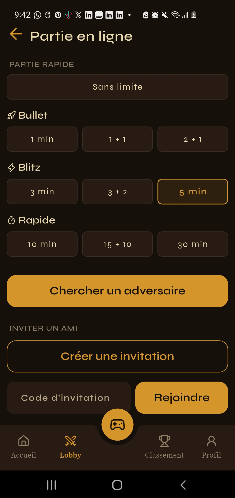
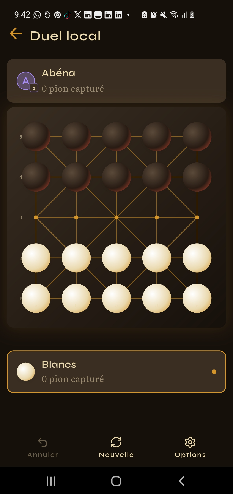
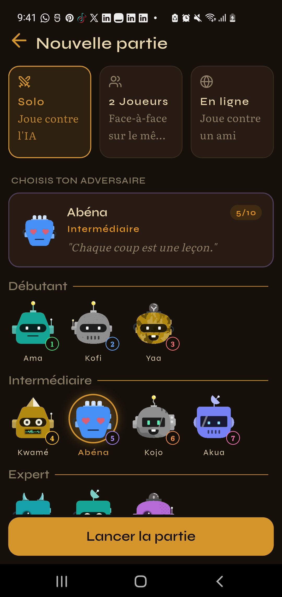
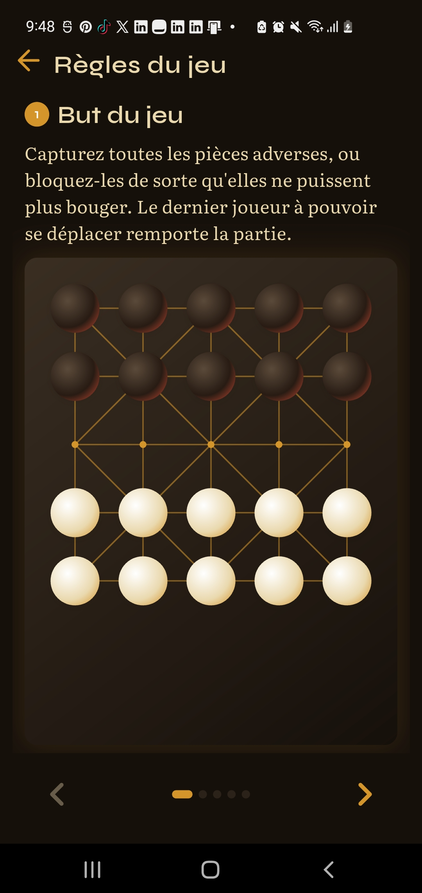

# MagiCarré

Application Flutter complète, connectée à un backend réel (Supabase), pour le
**Carré Magique** — jeu de stratégie traditionnel togolais. Authentification,
partie solo contre une IA, partie locale à deux joueurs, **partie en ligne en
temps réel**, classement, historique de parties, et mode hors-ligne avec cache
local.

---

## Sommaire

- [Captures d'écran](#captures-décran)
- [Fonctionnalités](#fonctionnalités)
- [Architecture](#architecture)
- [API & backend](#api--backend)
- [Cache local & mode hors-ligne](#cache-local--mode-hors-ligne)
- [Authentification & sécurité réseau](#authentification--sécurité-réseau)
- [Structure du projet](#structure-du-projet)
- [Configuration du projet](#configuration-du-projet)
- [Builds & environnements](#builds--environnements)
- [Tests](#tests)
- [Grille de l'exercice](#grille-de-lexercice)

---

## Captures d'écran

<table>
  <tr>
    <td align="center" width="33%">
      <br>
      <sub><b>Accueil</b> — stats, accès rapide aux modes, aperçu du classement</sub>
    </td>
    <td align="center" width="33%">
      <br>
      <sub><b>Lobby en ligne</b> — partie rapide, invitation, parties à reprendre</sub>
    </td>
    <td align="center" width="33%">
      <br>
      <sub><b>Plateau de jeu</b> — rendu façon Alquerque, animé</sub>
    </td>
  </tr>
  <tr>
    <td align="center" width="33%">
      <br>
      <sub><b>Partie solo</b> — contre l'IA, 10 niveaux de difficulté</sub>
    </td>
    <td align="center" width="33%">
      <br>
      <sub><b>Règles interactives</b> — déplacement, capture, promotion, victoire</sub>
    </td>
    <td align="center" width="33%">
      <br>
      <sub><b>Profil</b> — stats, historique de parties</sub>
    </td>
  </tr>
</table>

## Fonctionnalités

- **Authentification** — email/mot de passe + OAuth Google/GitHub, onboarding,
  configuration du profil, changement de mot de passe, déconnexion.
- **Partie solo** — contre une IA (moteur minimax, 10 personnages/niveaux de
  difficulté), plateau 5×5.
- **Partie locale à 2 joueurs** — sur le même appareil, pendule optionnelle.
- **Partie en ligne en temps réel** — matchmaking par file d'attente ou par
  code d'invitation, synchronisation live du plateau (Supabase Realtime),
  pendule vérifiée côté serveur, abandon, reconnexion.
- **Classement (leaderboard)** — top joueurs par ELO, rang personnel.
- **Historique de parties** — résultats, delta ELO, adversaire, date.
- **Mode hors-ligne** — les écrans de classement et d'historique affichent
  les dernières données connues (cache local) quand l'appareil est
  déconnecté, avec un bandeau explicite.

## Architecture

Clean Architecture **feature-first** : chaque fonctionnalité est un module
autonome avec ses trois couches.

```
lib/features/<feature>/
├── data/
│   ├── datasources/     # Accès réseau brut (Supabase SDK ou Dio REST)
│   ├── models/          # DTO JSON ↔ entité (fromJson / toJson)
│   └── repositories/    # Implémente le contrat domain, gère cache + erreurs
├── domain/
│   ├── entities/         # Objets métier purs, aucune dépendance externe
│   ├── repositories/     # Contrats abstraits (interfaces)
│   └── usecases/         # Une action métier = une classe, un point d'entrée
└── presentation/
    ├── pages/            # Écrans
    ├── providers/        # Riverpod (code-gen) — état exposé à l'UI
    └── widgets/          # Composants spécifiques à la feature
```

Le code partagé (`lib/shared/`) suit la même stratification : services HTTP,
cache, stockage, failures, et widgets réutilisables (`shared/presentation/`).

**Repository pattern** partout : chaque repository implémente un contrat
`domain/repositories/`, orchestre datasource + cache + détection réseau, et
ne laisse jamais fuir d'exception — tout retour passe par
`Either<Failure, T>` (voir plus bas).

**State management** : Riverpod avec génération de code (`@riverpod`),
providers `keepAlive` pour l'infrastructure (datasources, repositories),
`autoDispose` par défaut pour l'état d'écran.

## API & backend

Le backend est [Supabase](https://supabase.com) — Postgres géré + Auth +
Realtime + RPC. Deux façons distinctes d'y accéder cohabitent
volontairement dans le projet :

| Usage | Client | Où |
|---|---|---|
| Auth (login/register/OAuth/session/refresh) | SDK `supabase_flutter` | `features/auth/` |
| Realtime (sync de partie en ligne) | SDK `supabase_flutter` (`postgres_changes`) | `features/online/` |
| RPC (règles métier côté serveur — ELO, tours, appariement) | SDK `supabase_flutter` (`.rpc()`) | `features/game/`, `features/online/` |
| **Lecture du classement** | **Client REST maison (Dio)** appelant directement l'API PostgREST (`/rest/v1/user_profiles`) | `features/leaderboard/` |

Le SDK Supabase gère très bien l'auth, le Realtime et les RPC — le
réimplémenter serait artificiel. En revanche, la feature **Leaderboard**
appelle volontairement l'API REST **sans** passer par le SDK, via un client
Dio maison (`shared/data/services/http_service/`), pour démontrer la
construction d'un client HTTP complet : intercepteur d'auth, refresh
automatique du token, logs, gestion d'erreurs. Voir
[Authentification & sécurité réseau](#authentification--sécurité-réseau).

**RPC exposées côté serveur** (logique métier qui ne doit jamais être fiée
au client — voir `supabase/migrations/`) :

- `record_game_result` — calcule le nouvel ELO et enregistre l'historique.
- `queue_join` / `queue_leave` — matchmaking par file d'attente, appariement
  atomique (`SELECT ... FOR UPDATE SKIP LOCKED`).
- `create_invite_match` / `join_invite_match` — parties par code d'invitation.
- `submit_move` — vérifie que c'est bien le tour de l'appelant et recalcule
  son temps restant côté serveur (jamais fait confiance au client).
- `resign_match`, `claim_timeout`, `initialize_match_state`,
  `mark_match_recorded` — cycle de vie d'une partie en ligne.

## Cache local & mode hors-ligne

- **Stockage** : [Hive](https://pub.dev/packages/hive) (`shared/data/services/local_cache_service.dart`)
  — cache clé/valeur générique, aucun `TypeAdapter` nécessaire (les modèles
  sérialisent déjà en JSON via `toCacheJson()`/`fromCachedJson()`).
- **Détection réseau** : `NetworkInfo` (`shared/domain/network_info.dart`),
  implémenté avec `connectivity_plus` — abstraction testable, injectée dans
  les repositories (pas de dépendance directe à Riverpod dans la couche
  data).
- **Stratégie** (implémentée dans `LeaderboardRepositoryImpl` et
  `GameHistoryRepositoryImpl`) :
  1. Hors-ligne → lecture directe du cache, `Right` si présent,
     `Left(NetworkFailure)` sinon.
  2. En ligne → appel réseau ; en cas de succès, la réponse est à la fois
     retournée et écrite en cache (`cache-aside`) ; en cas d'échec réseau
     malgré une connectivité déclarée (ex. portail captif), repli sur le
     cache avant d'abandonner.
- **UI** : `OfflineBanner` (`shared/presentation/widgets/others/`) affiche un
  bandeau "Hors-ligne — affichage des données en cache" sur les écrans
  concernés, piloté par `isOnlineProvider` (`connectivity_plus`).

## Authentification & sécurité réseau

- Sessions JWT gérées par `supabase_flutter` (persistance + refresh
  automatique intégrés au SDK) pour tout l'auth et le Realtime.
- Pour le client REST maison (Leaderboard), la chaîne d'intercepteurs Dio
  (`shared/data/services/http_service/`) est **entièrement écrite pour ce
  projet** :
  - `AuthInterceptor` — injecte `Authorization: Bearer <token>` depuis la
    session Supabase courante sur chaque requête.
  - `RefreshInterceptor` — sur un 401, déclenche `auth.refreshSession()`,
    rejoue la requête avec le nouveau token ; sérialise les refreshes
    concurrents (`QueuedInterceptor`) pour n'en déclencher qu'un seul si
    plusieurs requêtes échouent simultanément ; déconnecte l'utilisateur si
    le refresh échoue.
  - `LoggingInterceptor` — logs requête/réponse en debug uniquement, ne
    logue jamais le header `Authorization`.
- Toutes les erreurs réseau/serveur remontent en `Either<Failure, T>`
  (`ServerFailure`, `NetworkFailure`, `AuthFailure`, `CacheFailure`,
  `ValidationFailure` — `shared/domain/failures/`) et sont affichées à
  l'utilisateur avec un message clair et un bouton "Réessayer" (jamais
  d'échec silencieux — voir par ex. `LeaderboardPage._LeaderboardError`).

## Structure du projet

```
lib/
├── core/                 # Routing, thème, extensions, configuration
├── features/
│   ├── auth/              # Login, register, OAuth, session, onboarding
│   ├── game/               # Moteur local (solo IA + 2 joueurs), historique
│   ├── online/             # Matchmaking, invitations, partie en ligne temps réel
│   ├── leaderboard/         # Classement — datasource REST/Dio + cache
│   ├── profile/            # Profil, édition, historique
│   ├── home/, learn/, settings/, welcome/
├── shared/
│   ├── data/services/       # http_service/ (Dio, intercepteurs), cache, stockage
│   ├── domain/               # Failures, Either, NetworkInfo (contrats partagés)
│   └── presentation/          # Widgets réutilisables, providers globaux
└── l10n/                  # Localisation FR/EN

supabase/
├── migrations/            # Schéma SQL horodaté, appliqué dans l'ordre
└── schema.sql             # Snapshot consolidé (les deux migrations combinées)

test/
└── features/.../data/repositories/   # Tests unitaires des repositories
```

## Configuration du projet

### Prérequis

- Flutter SDK (`sdk: ^3.14.0-68.0.dev` — voir `pubspec.yaml`)
- Un projet [Supabase](https://supabase.com) (gratuit)
- (Optionnel) Un client OAuth Google si vous voulez tester la connexion Google

### 1. Cloner et installer les dépendances

```bash
git clone https://github.com/Just2sire/flutter_fire_magi_carre.git
cd flutter_fire_magi_carre
flutter pub get
```

### 2. Configurer Supabase

1. Créez un projet sur [supabase.com](https://supabase.com).
2. Dans le **SQL Editor** du projet, exécutez dans l'ordre les fichiers de
   `supabase/migrations/` (ou directement `supabase/schema.sql`, qui contient
   les deux migrations concaténées).
3. Dans **Project Settings → API**, récupérez l'URL du projet et la clé
   publique (`anon` / `publishable`).
4. Dans **Authentication → Providers**, activez Email et (optionnel)
   Google / GitHub si vous voulez tester l'OAuth.

### 3. Variables d'environnement

Deux mécanismes cohabitent, `--dart-define-from-file` est prioritaire quand
les deux sont présents (voir [Builds & environnements](#builds--environnements)
pour le détail) :

**Rapide, pour `flutter run` sans flag** — copiez `.env.example` vers `.env` :

```bash
cp .env.example .env
```

```env
SUPABASE_URL=https://xxxxxxxx.supabase.co
SUPABASE_ANON_KEY=eyJ...
GOOGLE_WEB_CLIENT_ID=          # optionnel, requis uniquement pour OAuth Google
GOOGLE_IOS_CLIENT_ID=          # optionnel, build iOS uniquement
```

**Recommandé, notamment pour les builds release** — copiez les templates
`config/*.json.example` :

```bash
cp config/dev.json.example config/dev.json
cp config/prod.json.example config/prod.json
# puis complétez SUPABASE_URL / SUPABASE_ANON_KEY / etc. dans chaque fichier
```

### 4. Génération de code

Le projet utilise `riverpod_generator` (codegen des providers) :

```bash
dart run build_runner build --delete-conflicting-outputs
```

### 5. Lancer l'app

```bash
flutter run
```

## Builds & environnements

### Configuration par environnement (`--dart-define-from-file`)

Chaque environnement a son fichier de config sous `config/` :

| Fichier | Contenu | Committé ? |
|---|---|---|
| `config/dev.json` | Vraies valeurs de dev | ❌ gitignoré |
| `config/prod.json` | Vraies valeurs de prod | ❌ gitignoré |
| `config/dev.json.example`, `config/prod.json.example` | Templates | ✅ |

```bash
flutter run --dart-define-from-file=config/dev.json
```

Dans le code, `AppConfig` (`lib/core/configs/app_config.dart`) lit ces valeurs
via `String.fromEnvironment("SUPABASE_URL")` etc. — injectées à la
**compilation**, donc pas de fichier secret embarqué dans le binaire final.
`Env.current` (dev/staging/prod) suit la clé `"ENV"` du fichier de config et
pilote les logs, le nom affiché de l'app, etc.

Si `config/<env>.json` n'est pas fourni (ex. `flutter run` sans flag),
`AppConfig` retombe sur `.env` (flutter_dotenv) — pratique pour itérer vite en
local sans taper le flag à chaque fois, mais **pas utilisé pour les builds
release**.

### Obfuscation (production)

`--obfuscate` remplace les noms de symboles Dart par des identifiants
opaques dans le binaire livré — rend la rétro-ingénierie plus difficile.
`--split-debug-info=<dossier>` sauvegarde la table de correspondance
symbole ↔ nom original **séparément**, nécessaire pour désobfusquer une
stack trace de crash plus tard (`flutter symbolize`). **Committez et
conservez ce dossier pour chaque version publiée** — sans lui les rapports de
crash en prod sont illisibles.

### Split par ABI

`--split-per-abi` génère un APK distinct par architecture CPU
(`arm64-v8a`, `armeabi-v7a`, `x86_64`) au lieu d'un seul "fat APK" qui
embarque les trois — chaque utilisateur télécharge seulement l'APK pour son
appareil, nettement plus léger. Sans intérêt pour l'App Bundle (`.aab`) :
Google Play fait déjà ce découpage lui-même à l'installation.

### Scripts

`scripts/build.ps1` (Windows) / `scripts/build.sh` (macOS/Linux/Git Bash)
enchaînent tout ça :

```bash
# Debug rapide, config/dev.json, pas d'obfuscation
./scripts/build.sh dev

# Release Android : obfusqué, symboles sauvegardés, split par ABI, config/prod.json
./scripts/build.sh prod

# Release Play Store : App Bundle au lieu des APKs splittés
./scripts/build.sh prod --bundle
```

```powershell
.\scripts\build.ps1 dev
.\scripts\build.ps1 prod
.\scripts\build.ps1 prod -Bundle
```

### Commandes brutes (référence)

```bash
# Android
flutter build apk --release --obfuscate \
  --split-debug-info=build/app/outputs/symbols --split-per-abi \
  --dart-define-from-file=config/prod.json

# iOS (nécessite `flutter create --platforms=ios .` au préalable — le
# projet n'a pas encore la plateforme iOS initialisée)
flutter build ipa --obfuscate \
  --split-debug-info=build/app/outputs/symbols \
  --dart-define-from-file=config/prod.json
```

## Tests

```bash
flutter test
```

Tests unitaires sur la couche repository (mocks via `mocktail`, aucun appel
réseau réel) :

- `test/features/leaderboard/data/repositories/leaderboard_repository_impl_test.dart`
  — succès réseau, repli sur cache hors-ligne, absence de cache hors-ligne,
  repli sur cache après échec réseau, absence de cache après échec réseau,
  cas `fetchMyRank` (utilisateur introuvable, succès + mise en cache).
- `test/features/game/data/repositories/game_history_repository_impl_test.dart`
  — mêmes scénarios pour l'historique de parties, plus `recordGameResult`
  (succès / échec RPC).

Chaque test vérifie le type de retour (`Right`/`Left`), le contenu, et les
interactions attendues avec le datasource/cache mockés (ex. le datasource
réseau ne doit **jamais** être appelé quand l'appareil est hors-ligne).

## Grille de l'exercice

| Exigence | Statut | Où |
|---|---|---|
| Auth login/register/logout (JWT/OAuth) | ✅ | `features/auth/` |
| ≥3 écrans de données API REST | ✅ | Leaderboard, Historique, Lobby en ligne, Profil, Home |
| Cache local (Hive/Isar/SQLite) | ✅ Hive | `shared/data/services/local_cache_service.dart` |
| Mode hors-ligne | ✅ | `NetworkInfo` + `OfflineBanner`, repositories Leaderboard & Historique |
| Gestion d'erreurs réseau + messages utilisateur | ✅ | `Either<Failure, T>` partout, vues d'erreur avec retry |
| Architecture Clean / Feature-First | ✅ | voir [Architecture](#architecture) |
| Repository pattern | ✅ | un repository par feature, contrat dans `domain/` |
| Dio ou http | ✅ Dio | client REST maison pour le Leaderboard |
| Intercepteur d'injection du token | ✅ | `AuthInterceptor` |
| Refresh token | ✅ | `RefreshInterceptor` |
| ≥3 tests unitaires repository | ✅ (11) | voir [Tests](#tests) |

**Note d'architecture** : l'authentification, le Realtime et les RPC métier
restent sur le SDK `supabase_flutter` plutôt que d'être réimplémentés en Dio
brut — ni PostgREST ni le protocole Realtime de Supabase n'ont d'intérêt
pédagogique à être reconstruits à la main, et le SDK gère déjà correctement
la persistance de session. Le client Dio + intercepteurs est démontré sur la
feature Leaderboard, qui s'y prête naturellement (lecture REST simple, sans
besoin de temps réel).
